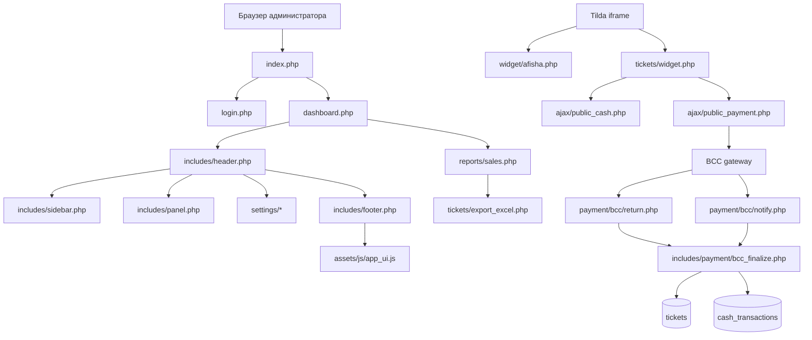
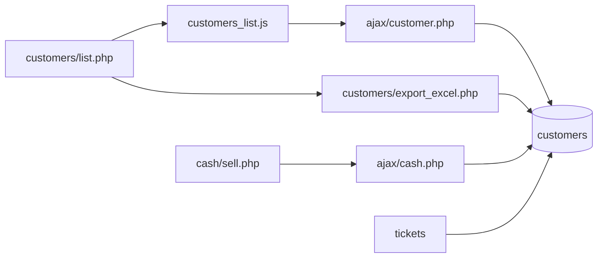

# Структура и связи файлов

## Общая схема

## Инициализация

- `config.php` — читает переменные окружения и задаёт URL/таймзону.
- `init.php` — запускает безопасную сессию, подключает БД, helper/auth и PDF-хелперы.
- `includes/db.php` — PDO-подключение и функции `db_fetch_one`, `db_fetch_all`, `db_query`.
- `includes/helper.php` — экранирование, телефонные функции, maintenance-ответ и общие утилиты.
- `includes/auth.php` — вход, текущий пользователь, timeout, logout, password policy.

## Админская оболочка

- `includes/header.php` — HTML head, CSS, верхняя шапка и текущий пользователь.
- `includes/sidebar.php` — основное меню, настройки и выход.
- `includes/panel.php` — заголовок конкретной страницы.
- `includes/footer.php` — общие JS, тосты, модалки удаления и выхода.
- `dashboard.php` — админская оболочка панели и встроенный отчёт продаж.

## Настройки

- `includes/settings_manager.php` — карта страниц, категории, чтение/сохранение настроек.
- `settings/_page.php` — универсальный CRUD-рендер настроек.
- `settings/general.php` — системные параметры и режим обслуживания.
- `settings/security.php` — парольная политика, сессии и защита входа.
- `settings/interface.php` — параметры интерфейса без preview витрины.
- `settings/tickets.php` — лимиты билетов и резервы.
- `settings/payment.php` — BCC и эквайринг.
- `settings/notifications.php` — уведомления и BCC callback.
- `settings/users.php` — пользователи системы.
- `settings/permissions.php` — права ролей.

Настройки хранятся в таблице `settings` и создаются через `settings_upsert_value`.

## Продажи и билеты

- `cash/index.php` — выбор сеанса и кассовый список.
- `cash/sell.php` — кассовая продажа и клиентские данные.
- `ajax/cash.php` — кассовые операции, поиск клиентов, резервирование и продажа.
- `tickets/list.php` — список билетов, фильтры, возвраты и экспорт.
- `tickets/view.php` — просмотр билета.
- `tickets/generate.php` — защищённая генерация/выдача PDF.
- `tickets/public.php` — публичная страница заказа, QR, PDF и возврат.
- `includes/pdf_helpers.php` — генерация, хранение и очистка PDF в `uploads/tickets/`.

## Клиенты

- `customers/list.php` — таблица клиентов, живой поиск, пагинация, действия.
- `customers/export_excel.php` — XLSX клиентов.
- `assets/js/customers_list.js` — AJAX-поиск, edit modal, delete modal, pagination.
- `ajax/customer.php` — список, поиск, создание, редактирование и удаление клиентов.

Связи:

## Отчёты и Excel

- `reports/sales.php` — фильтры, KPI, продажи по типам, оплаты и возвраты.
- `reports/export_excel.php` — экспорт отчёта продаж.
- `tickets/export_excel.php` — экспорт билетов с фильтрами и итогами.
- `includes/excel.php` — загрузчик PhpSpreadsheet.
- `composer.json` — зависимости Dompdf, QR Code и PhpSpreadsheet.

## Публичный виджет и BCC

- `widget/afisha.php` — JSON/HTML афиша для Tilda.
- `tickets/widget.php` — iframe выбора мест и покупки.
- `ajax/public_cash.php` — публичная схема зала, доступность и клиентский резерв.
- `ajax/public_payment.php` — создание BCC payment session.
- `ajax/public_refund.php` — публичный возврат.
- `payment/bcc/return.php` — возврат пользователя из банка.
- `payment/bcc/notify.php` — серверные уведомления банка.
- `includes/payment/bcc.php` — конфигурация, подписи и BCC form.
- `includes/payment/bcc_finalize.php` — общий идемпотентный финализатор покупки.
- `includes/payment/bcc_refund.php` — TRTYPE=14.

## Файловая защита

- `.htaccess` — запрет индексации, исходников, служебных каталогов и PHP в uploads.
- `includes/.htaccess` — запрет прямого доступа к внутренним PHP.
- `vendor/.htaccess` — запрет прямого доступа к зависимостям.
- `sql/.htaccess`, `logs/.htaccess`, `tools/.htaccess`, `tests/.htaccess`, `cgi-bin/.htaccess` — запрет внутренних каталогов.
- `uploads/tickets/.htaccess` — PDF доступны только как PDF, выполнение скриптов запрещено.

## Данные

Основные таблицы:

- `users` — учётные записи;
- `settings` — настройки кабинета;
- `customers` — клиенты;
- `events` — спектакли;
- `schedules` — сеансы;
- `halls`, `seats` — залы и места;
- `tickets` — билеты;
- `payment_sessions` — онлайн-заказы;
- `cash_transactions` — операции оплаты/возврата;
- `cash_holds`, `seat_occupancy` — временная блокировка мест;
- `refunds` — возвраты.
